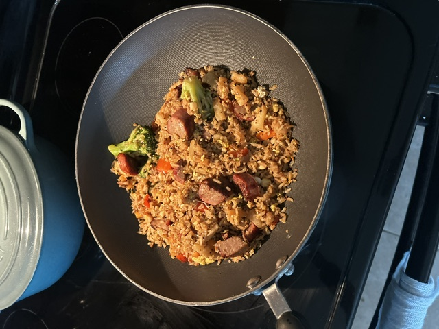

# Black Pepper Pineapple Chicken Fried Rice

**Version:** v1.0  
**Status:** Proven  
**Author:** VaporWare Labs
**Prep Time:** 30 minutes (plus overnight rice/chicken)
**Cook Time:** 20 minutes
**Servings:** 4–6

---

## Rating

⭐⭐⭐⭐⭐

> This version is a keeper.

## Flavor Profile

🟡 Sweet

🟤 Savory

⚫ Pepper Forward

🌶 Mild Heat (optional)

---

## Objective

Create a sweet and savory fried rice with a noticeable black pepper finish and fresh pineapple flavor. The goal is a dish that balances sweetness, saltiness, umami, and spice without becoming overly saucy.

---

# Equipment

- Instant Pot (rice)
- Large skillet or wok
- Cutting board
- Chef's knife
- Measuring spoons
- Wooden spatula

---

# Ingredients

## Rice

- 1 cup Jasmine rice
- 1¼ cups water

Cook the rice the day before and refrigerate overnight.

---

## Chicken

- 4 boneless chicken thighs
- Dry brine:
  - Kosher salt
  - Fresh ground black pepper

---

## Vegetables

- ½ onion, diced
- 2 carrots, diced
- 2 celery stalks, diced
- 3 cloves garlic, minced

---

## Fruit

- 1 cup fresh pineapple
- Reserve approximately 2 tablespoons pineapple juice

---

## Other

- 2 eggs
- 2 tablespoons butter (preferred) or neutral cooking oil
- Chopped Peanuts (optional)
- Chili oil (optional)

---

# Sauce

- 1 tablespoon Sweet Soy Sauce
- 1 tablespoon Worcestershire Sauce
- 1 tablespoon Toasted Sesame Oil
- 2 tablespoons Pineapple Juice

Mix before cooking.

---

# Preparation

## Rice

Cook the rice the night before.

Allow it to cool completely before refrigerating.

Day-old rice produces a much better fried rice texture.

---

## Chicken

Dry brine overnight.

Pressure cook:

- High Pressure
- 5 minutes
- Natural Release: 5 minutes

Dice into bite-sized pieces.

---

# Cooking Procedure

## 1. Vegetables & Pineapple

Heat butter or oil in a large skillet or wok.

Cook together:

- Onion
- Carrots
- Celery
- Fresh pineapple

Season generously with freshly cracked black pepper.

Cook until the vegetables soften and the pineapple begins to caramelize.

Add the garlic during the final minute.

Add another light grind of black pepper.

---

## 2. Rice

Add the cold, day-old jasmine rice.

Break apart any clumps and stir until heated evenly.

Season again with freshly cracked black pepper.

Allow portions of the rice to brown lightly before stirring.

---

## 3. Sauce

Pour the prepared sauce evenly over the rice.

Stir until evenly coated.

Add another grind of black pepper while mixing.

Cook for another minute to allow the sauce to absorb into the rice.

---

## 4. Finish

Fold in the diced cooked chicken until just heated through.

Create a well in the center of the pan.

Pour in **2 beaten eggs**.

Fold the eggs into the rice until just cooked.

Finish with:

- One final generous grind of freshly cracked black pepper
- Chili oil (optional)
- Peanuts (optional)

Serve immediately.
---

# Lessons Learned

- Day-old rice makes a huge difference.
- Fresh cracked black pepper is one of the primary flavors—not just a seasoning.
- Cooking the pineapple with the vegetables allows it to lightly caramelize and become part of the flavor base.
- The combination of pineapple juice and Worcestershire creates an excellent sweet/umami balance.

### Pepper Philosophy

This recipe intentionally layers freshly cracked black pepper throughout the cooking process instead of adding it only at the end.

Each addition contributes a different character:
- Early additions mellow and infuse the vegetables.
- Mid-cook additions flavor the rice.
- The final addition provides a fresh, aromatic finish.

Black pepper is treated as a primary ingredient rather than simply a seasoning.

---

# Future Experiments

## Version 1.1

- Try cashews instead of peanuts.
- Increase black pepper slightly.
- Add green onions.
- Experiment with smoked paprika.

## Version 1.2

- Grill the pineapple before adding.
- Try dark soy sauce.
- Compare jasmine vs. basmati rice.

---

# VaporWare Notes

**Experiment. Share Results. Enjoy the Process.**

Every recipe in vaporCHEF is version-controlled and evolves through experimentation. Improvements are documented so future revisions build on proven results rather than starting over.